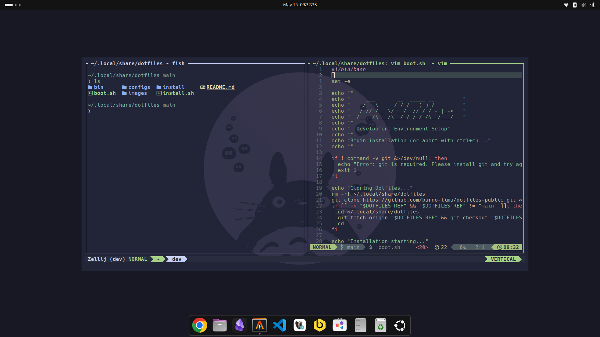
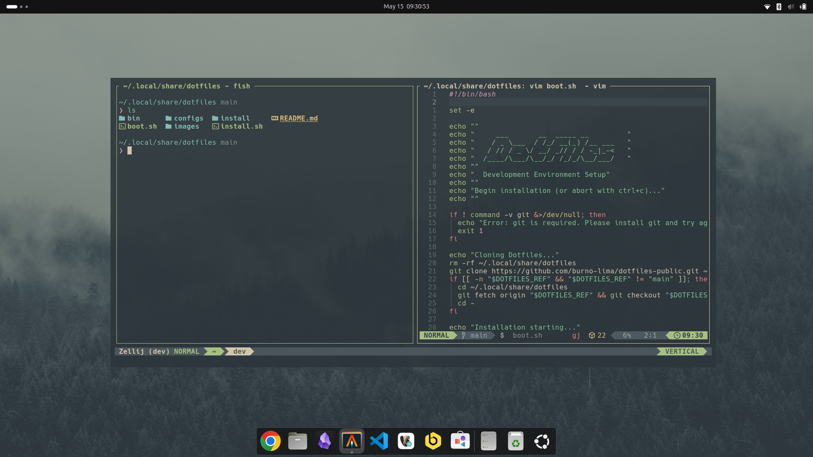
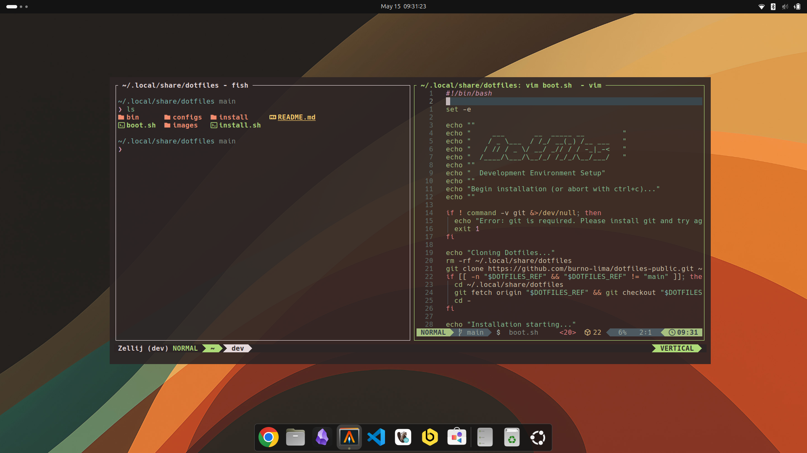

# OmakDot

Development environment setup and theme automation for GNOME.

- **Installs** your favorite dev tools: Fish, Neovim, Docker, mise, Zellij, LazyGit, and more
- **Installs** desktop apps: VS Code, Chrome, Obsidian, JetBrains Toolbox, Alacritty, and more
- **Configures** everything with sensible defaults
- **Theme automation**: switch your entire desktop theme from the **GNOME Quick Settings** panel

## Requirements

- GNOME desktop environment (42+)
- `git`
- `curl`

## Installation

```bash
curl -fsSL https://raw.githubusercontent.com/burno-lima/omakdot/master/boot.sh | bash
```

After installation, log out and back in for the extension to load.

## What's Installed

### Terminal Tools
| Tool | Description |
|------|-------------|
| **Fish** shell | User-friendly shell with Pure prompt theme |
| **Neovim** | Modern Vim fork with LazyVim starter |
| **mise** | Dev tool version manager (Node, Python, Go) |
| **Docker** | Container runtime + docker compose |
| **Zellij** | Terminal multiplexer |
| **LazyGit** | Terminal UI for git |
| **eza** | Modern `ls` replacement |
| **btop** | System resource monitor |
| **Claude Code** | AI coding assistant |
| **OpenCode** | AI coding assistant |
| **rclone** | Cloud storage sync |

### Desktop Apps
| App | Description |
|-----|-------------|
| **VS Code** | Editor with Claude Code extension |
| **Google Chrome** | Browser (set as default) |
| **Alacritty** | GPU-accelerated terminal (set as default) |
| **Obsidian** | Note-taking |
| **JetBrains Toolbox** | JetBrains IDE manager |
| **DBeaver CE** | Database management |
| **Beekeeper Studio** | SQL database GUI |
| **GNOME Tweaks** | GNOME customization |
| **Flatpak + Flathub** | App sandboxing |

### Fonts
- Hack Nerd Font
- Cascadia Mono Nerd Font

## Usage

Click the **Theme** button in the GNOME Quick Settings panel (top-right corner) to switch themes instantly across: GNOME desktop, Alacritty, Zellij, btop, Neovim, VS Code, Fish, and Chrome.

## Available Themes

| Theme | Color | Style |
|-------|-------|-------|
| Tokyo Night | Purple | Dark, vibrant |
| Catppuccin | Mauve | Warm pastel |
| Nord | Blue | Arctic cool |
| Everforest | Green | Soft nature |
| Gruvbox | Orange | Retro warm |
| Kanagawa | Blue | Japanese wave |
| Ristretto | Brown | Coffee tones |
| Rose Pine | Pink | Elegant muted |
| Matte Black | Dark | Minimal dark |
| Solarized Osaka | Viridian | Solarized dark |

## Screenshots

| Catppuccin | Everforest | Ristretto |
|------------|------------|-----------|
|  |  |  |

## Updating

### Full update (tools + themes)

```bash
cd ~/.local/share/omakdot && git pull && bash install.sh
```

### Theme-only update

After the initial setup, if you only modified theme files or pulled theme changes from the repo, you can update just the theme infrastructure without reinstalling tools:

```bash
cd ~/.local/share/omakdot && git pull && bash install.sh --themes-only
```

This will update the GNOME Shell extension and `apply-theme.sh` script, skipping all tool installations and default theme application. Use the GNOME Quick Settings button or `apply-theme.sh` manually to switch themes after the update.

## Individual Package Installation

After the initial setup, you can install individual packages:

```bash
source ~/.local/share/omakdot/install/terminal/fish.sh
source ~/.local/share/omakdot/install/terminal/docker.sh
```

## License

This project is released under the [MIT License](https://opensource.org/licenses/MIT), same as the original [Omakub](https://github.com/basecamp/omakub) project by Basecamp.
